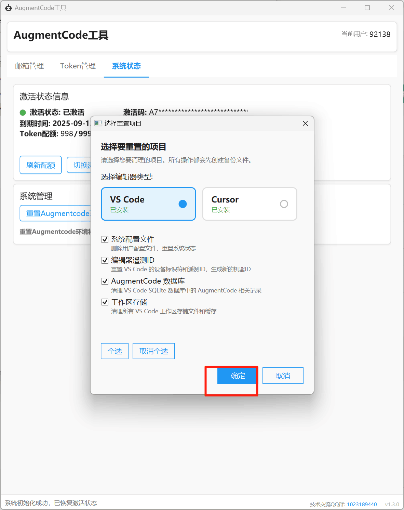

# AugmentCode 无限续杯工具

## 项目简介

**AugmentCode增强工具** - 专为AugmentCode用户设计的强大辅助工具，提供完整的账号管理和环境重置解决方案。

  
   
  <strong>QQ交流群：1023189440</strong>

### 🎯 核心功能
- 🧹 **一键环境清理** - AugmentCode全方位环境重置，稳定使用不封号
- 🚀 **免安装** - 绿色单文件，下载即用
- 🔐 **无需注册** - 直接使用，无需繁琐注册流程
- 🌐 **云端Token** - 直接从服务器拉取账号，一键无感换号

## ✨ 功能特性

### 🧹 环境清理功能
- ✅ **一键清理** - 支持多种清理选项，可选择性清理不同环境数据
- ✅ **智能保留** - 可选择不清理工作区，保留会话记录
- ✅ **全面重置** - 首次建议全部清理，确保环境干净
- ✅ **稳定可靠** - 实测稳定使用不封号

### � 云端Token管理
- ✅ **服务器拉取** - 直接从云端服务器获取可用账号Token
- ✅ **一键切换** - 无感切换不同账号，操作简单便捷
- ✅ **自动登录** - 配合插件支持自动登录功能
- ✅ **实时更新** - 云端Token实时更新，保证可用性

### 🛠️ 系统特性
- ✅ **免安装** - 单文件执行，绿色免安装
- ✅ **无需注册** - 直接使用，无需账号注册
- ✅ **自动化流程** - 全自动化操作，省时省力
- ✅ **友好界面** - 直观易用的图形界面
- ✅ **安全可靠** - 多重安全机制保护

## 📺 视频教程

**完整使用教程（包含AugmentCode注册和工具使用）**

> 视频内容包括：AugmentCode账号注册、工具下载使用、常见问题解决等完整流程

## 📸 功能截图

  <table>
    <tr>
      <td align="center">
        
         
        <strong>� 插件安装</strong>
         
        安装插件以支持自动登录功能
      </td>
      <td align="center">
        
         
        <strong>🧹 环境清理一键</strong>
         
        第一次建议全部清理，后续可不勾选工作区来保留会话记录
      </td>
    </tr>
    <tr>
      <td align="center" colspan="2">
        
         
        <strong>🌐 拉取云端Token</strong>
         
        直接一键切换要使用的账号
      </td>
    </tr>
  </table>

## 🚀 使用方法

### 📥 快速开始
1. **下载工具** - 下载 `AugmentUnlimitedRefills_SingleFile.zip` 文件
2. **解压运行** - 解压到任意目录，运行主程序
3. **安装插件** - 按照界面提示安装插件以支持自动登录
4. **环境清理** - 首次使用建议全部清理，后续可选择性保留工作区
5. **拉取Token** - 一键从云端拉取可用账号Token
6. **开始使用** - 享受稳定的AugmentCode服务

### 💡 使用建议
- **首次使用**：建议全部清理环境，确保干净的使用环境
- **日常使用**：可不勾选工作区清理，保留会话记录
- **账号切换**：直接点击拉取云端Token，一键切换账号

## ⚠️ 注意事项

- 请确保网络连接正常
- 首次使用建议全部清理环境
- 后续使用可选择性保留工作区数据

## 📄 免责声明

本工具仅供学习和研究目的使用，请遵守相关服务条款和法律法规。使用本工具所产生的任何后果由用户自行承担。

## 📄 许可证

本项目采用 MIT 许可证，详情请查看 LICENSE 文件。
