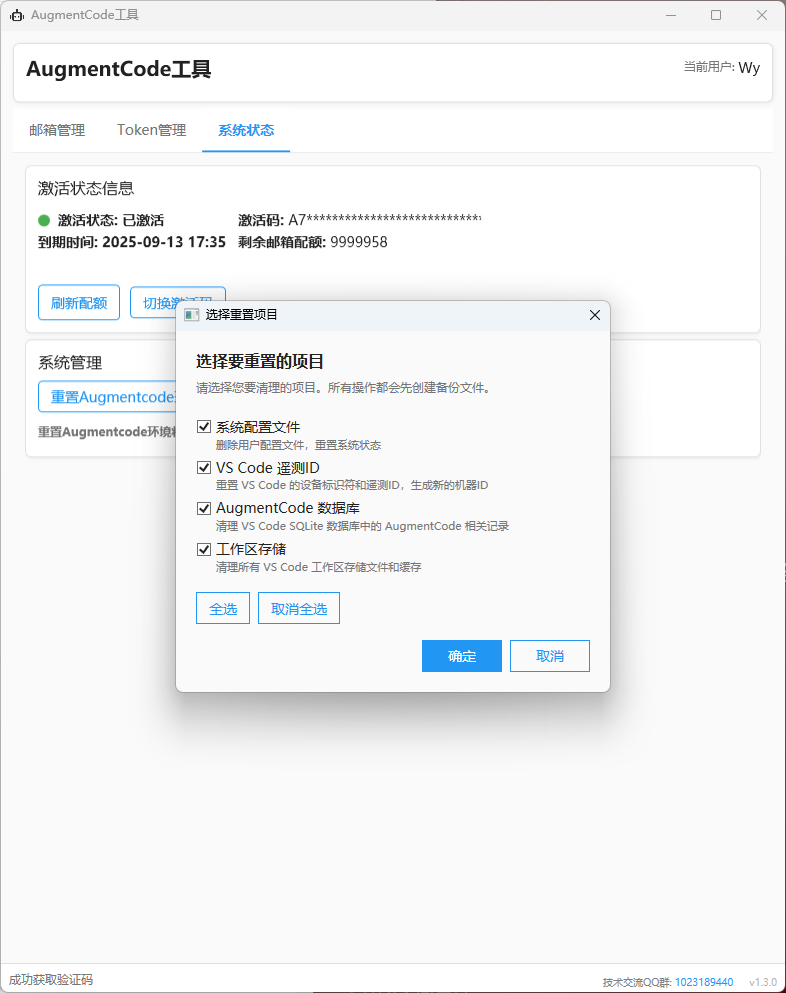
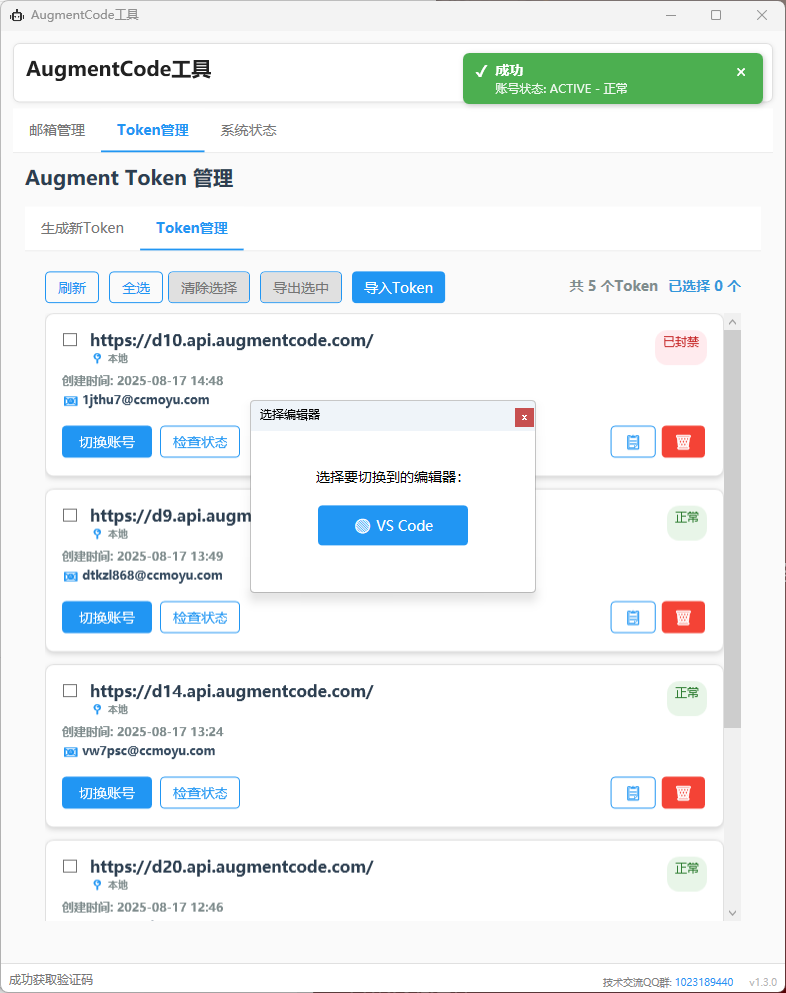
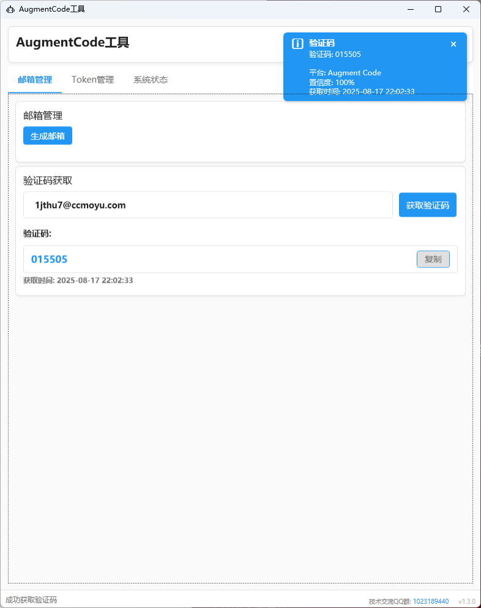

# AugmentCode 无限续杯工具

## 🎉 免费试用 - 完整功能体验

**完全免费试用！** 加入交流群即可免费体验完整功能，包含Token管理、环境重置、账号切换等所有高级功能。

  <table>
    <tr>
      <td align="center">
        
         
        <strong>QQ群</strong>
         
        群号：1023189440
      </td>
      <td align="center">
        
         
        <strong>微信群</strong>
         
        扫码加入
      </td>
    </tr>
  </table>

### 免费试用说明
- 🆓 **完全免费试用** - 无需付费，体验所有功能
- 🔧 **Token管理** - 账号切换神器，支持A用户注册B用户使用的导入导出
- 🔄 **环境重置** - AugmentCode全方位环境重置，100%解决露头就秒
- 💬 **技术支持** - 群内技术问题交流讨论
- 📖 **使用指导** - 详细的工具使用教程
- 🔔 **及时更新** - 第一时间获取功能更新信息

---

## 项目简介

**免费试用的AugmentCode增强工具！** 专为AugmentCode用户设计，提供完整的账号管理和环境重置解决方案：

### 🎯 核心功能
- 🔄 **AugmentCode全方位环境重置** - 100%解决露头就秒，支持多种重置方式选择
- 🎫 **Token管理系统** - 账号切换神器，支持A用户注册B用户使用的Token共享
- ☕ **无限续杯** - 突破使用限制，享受无限制的AI编程助手服务
- 📧 **多邮箱支持** - 智能邮箱管理和自动切换
- 🛠️ **单文件部署** - 绿色免安装，一键运行

## ✨ 功能特性

### 🔄 环境重置功能
- ✅ **多种重置方式** - 支持环境重置时勾选不同的重置方式
- ✅ **100%成功率** - AugmentCode全方位环境重置，解决露头就秒
- ✅ **智能检测** - 自动识别环境状态，精准重置

### 🎫 Token管理功能
- ✅ **账号切换** - 专为账号切换设计，快速切换不同AugmentCode账号
- ✅ **Token共享** - 支持A用户注册账号，B用户导入使用Token
- ✅ **导入导出** - 一键导出Token配置，分享给其他用户使用
- ✅ **批量管理** - 支持多个Token的批量导入导出管理
- ✅ **安全存储** - 本地加密存储，保护Token安全

### 🛠️ 系统特性
- ✅ **单文件执行** - 绿色免安装，无需复杂依赖
- ✅ **多邮箱支持** - 支持主流邮箱服务商
- ✅ **自动化流程** - 全自动化操作，省时省力
- ✅ **友好界面** - 直观易用的图形界面
- ✅ **安全可靠** - 多重安全机制保护

## 📺 视频教程

**完整使用教程（包含AugmentCode注册和工具使用）**

> 视频内容包括：AugmentCode账号注册、工具下载使用、常见问题解决等完整流程

## 📸 功能截图

  <table>
    <tr>
      <td align="center">
        
         
        <strong>🔄 环境重置</strong>
         
        支持多种重置方式选择，解决露头就秒
      </td>
      <td align="center">
        
         
        <strong>🎫 Token管理</strong>
         
        多账号管理、切换、导入导出
      </td>
    </tr>
    <tr>
      <td align="center" colspan="2">
        
         
        <strong>📧 邮箱获取</strong>
         
        智能邮箱管理和自动获取
      </td>
    </tr>
  </table>

## 🚀 使用方法

### 🆓 免费试用方式（推荐）
1. **加入交流群** - 扫描上方二维码加入交流群（QQ群号：1023189440）
2. **获取免费授权** - 在群内即可获取完整功能免费试用权限
3. **下载工具** - 下载 `AugmentUnlimitedRefills_SingleFile.zip` 文件
4. **解压运行** - 解压到任意目录，运行主程序
5. **输入授权** - 输入群内获取的授权码
6. **开始使用** - 享受Token管理、环境重置等完整功能

### 📥 快速体验
1. 下载 `AugmentUnlimitedRefills_SingleFile.zip` 文件
2. 解压到任意目录
3. 运行主程序
4. 按照界面提示进行操作

> 💡 **提示**：加入交流群可获得更好的技术支持和使用指导

## 注意事项

- 请确保网络连接正常
- 建议在使用前备份重要数据
- 仅供学习和研究使用

## 免责声明

本工具仅供学习和研究目的使用，请遵守相关服务条款和法律法规。使用本工具所产生的任何后果由用户自行承担。

## 🙏 致谢

### Token管理功能实现来源
本项目的Token管理功能基于以下开源项目实现：

**[augment-token-mng](https://github.com/zhaochengcube/augment-token-mng)** - 由 [@zhaochengcube](https://github.com/zhaochengcube) 大佬开发

感谢该项目为AugmentCode Token管理提供的优秀解决方案！

## 🤝 贡献

欢迎提交 Issue 和 Pull Request 来改进这个项目。

## 📄 许可证

本项目采用 MIT 许可证，详情请查看 LICENSE 文件。
