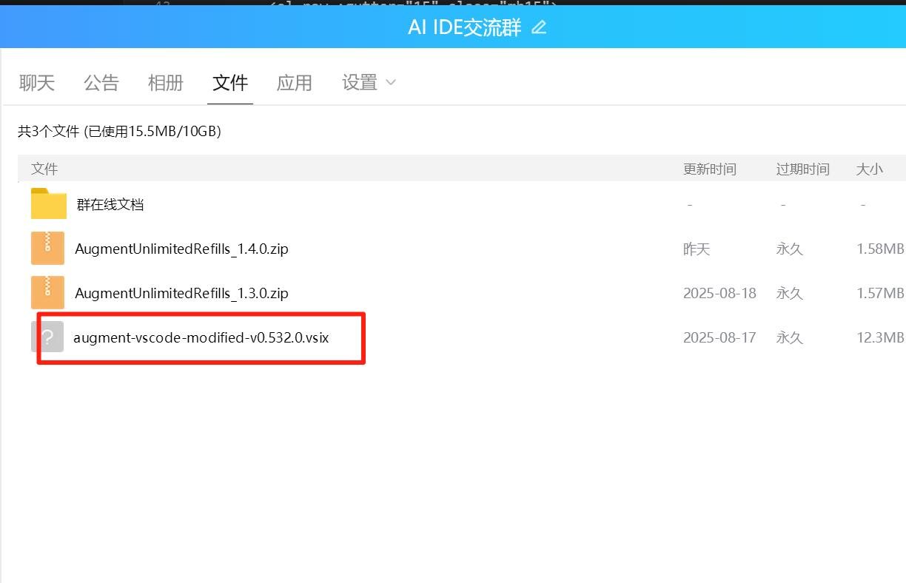
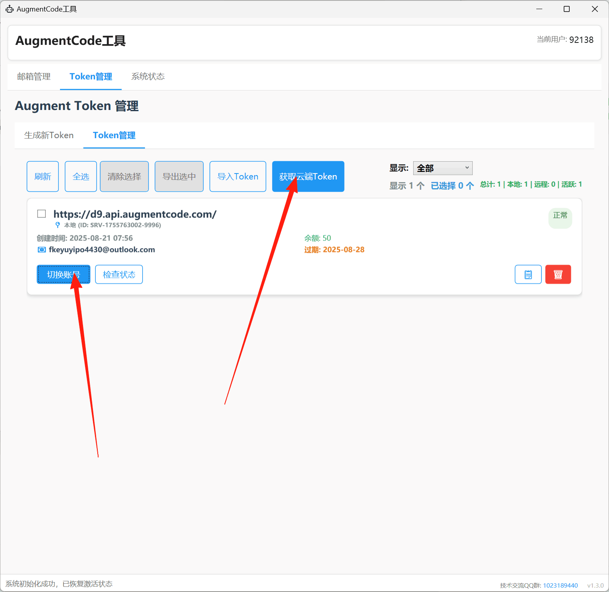

# AugmentCode 无限续杯工具 - 使用教程

## 🎯 产品介绍

**AugmentCode 无限续杯工具** - 强大的Augment清理工具，让您无需注册账号即可使用Augment！

### ✨ 核心优势
- 🚀 **无需注册** - 直接提供平台账号，独享50额度
- 🛡️ **100%稳定** - 目前稳定使用，经过大量用户验证
- 🧹 **强大清理** - 支持强大的Augment环境清理功能
- 💻 **简单易用** - 一键操作，小白也能轻松上手

### 📺 视频教程

**完整使用教程（包含详细操作步骤）**

> 视频内容包括：工具下载、插件安装、环境清理、账号获取等完整流程

### 🔗 项目地址

**GitHub项目地址（方便收藏和获取最新版本）**

> 项目地址仅供用户收藏和获取最新版本，非开源项目

---

## 📋 系统要求

### ⚠️ 重要提醒
- ✅ **仅支持Windows平台**
- ✅ **Windows用户名称不能为中文**
- ✅ **VSCode需使用默认安装路径**

---

## 🚀 详细使用流程

### 第一步：加入QQ群获取工具
1. **加入QQ群：1023189440**
2. **下载工具文件和魔改插件**
   - 工具主程序
   - 魔改Augment插件（VSIX文件）

### 第二步：安装VSCode
1. **下载VSCode** - 从官网下载最新版本
2. **使用默认安装路径** - 安装时保持默认路径不变
3. **确保安装完成** - 能正常启动VSCode

### 第三步：安装魔改插件
1. **打开VSCode**
2. **使用快捷键** - 按 `Ctrl+Shift+P` 打开命令面板
3. **搜索VSIX** - 输入"VSIX"找到安装选项
4. **安装插件** - 选择群里下载的魔改Augment插件文件

*插件安装步骤示意图*

### 第四步：环境清理
1. **关闭VSCode** - 确保VSCode完全关闭
2. **运行清理工具** - 打开下载的工具主程序
3. **执行清理功能** - 点击环境清理按钮
4. **等待清理完成** - 清理过程中请勿操作VSCode

*环境清理功能界面*

### 第五步：获取云端账号
1. **确认插件和清理都完成**
2. **点击获取云端Token** - 在工具中选择账号获取功能
3. **一键切换账号** - 直接使用平台提供的50额度账号
4. **开始使用** - 享受稳定的Augment服务

*云端Token获取和账号切换界面*

---

## 🛠️ 售后支持

### 📞 联系方式
- **QQ群：1023189440**
- **统一售后** - 加入QQ群进行统一售后服务

### 🤝 技术支持
- ✅ **群内反馈** - 有任何问题可以在群里反馈
- ✅ **群主解决** - 复杂问题可以直接找群主解决
- ✅ **实时响应** - 工作时间内快速响应用户问题
- ✅ **远程协助** - 必要时提供远程协助服务

---

## ⚠️ 注意事项

### 📌 使用须知
- 请确保按照流程顺序操作
- 清理环境时务必关闭VSCode
- Windows用户名不能包含中文字符
- 遇到问题及时在群内反馈

### 🔒 安全提醒
- 仅从官方群内下载工具和插件
- 不要随意修改工具配置
- 定期关注群内更新通知

---

## 📈 更新日志

工具会持续更新优化，请关注QQ群内的更新通知，及时下载最新版本以获得更好的使用体验。

---

**客服QQ群：1023189440**  
**7×12小时技术支持，让您使用无忧！**
